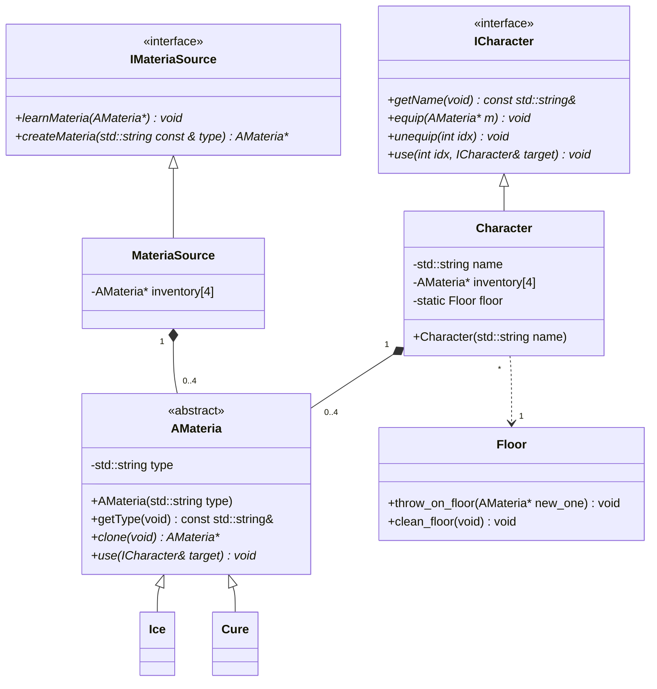

```mermaid

classDiagram
AMateria <|-- Ice
AMateria <|-- Cure

class AMateria{
	<<abstract>>
	-std::string type
	+AMateria(std::string type)
	+getType(void) const std::string&
	+clone(void) AMateria**
	+use(ICharacter& target) void*
}

ICharacter <|-- Character
Character "1" *-- "0..4" AMateria
Character "*" ..> "1" Floor

class ICharacter{
	<<interface>>
	+getName(void) const std::string&*
	+equip(AMateria* m) void*
	+unequip(int idx) void*
	+use(int idx, ICharacter& target) void*
}

class Character{
	-std::string name
	-AMateria* inventory[4]
	-static Floor floor
	+Character(std::string name)
}

class Floor{
	+throw_on_floor(AMateria* new_one) void
	+clean_floor(void) void
}

IMateriaSource <|-- MateriaSource
MateriaSource "1" *-- "0..4" AMateria

class IMateriaSource{
	<<interface>>
	+learnMateria(AMateria*) void*
	+createMateria(std::string const & type) AMateria**
}

class MateriaSource{
	-AMateria* inventory[4]
}

```
